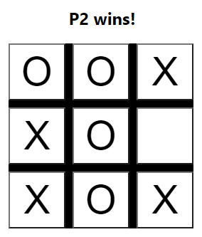

# tictactoe-python
Tic-Tac-Toe solved with Reinforcement Learning in Python!

Play live at [luisdasilva.io/tictactoe](https://luisdasilva.io/tictactoe)

Checkout the UI at [tictactoe-ui](https://github.com/luisds95/tictactoe-ui)

## Pre-requisites
To play TicTacToe, you must have installed:

- [Python ^3.9](https://www.python.org/)
- [Poetry](https://python-poetry.org/docs/master/)

## Installation
To install, simply run `make install`. 

Alternatively, run `poetry install`. 

You can verify your installation with `make test`.

That's it 🐱‍👤.

## Usage
When activating the environment (by running `poetry shell`, or alternatively, prefixing every command with `poetry run`) the `tictactoe` CLI will be available. To play, use `tictactoe play`. The CLI expects you to provide the name of the two agents that will be playing, valid names are: human, random and searcher. 

There is a web API available that will start by running `tictactoe start-api`. Check it out at `http://127.0.0.1:5000/`. You can pass an encoded board to get its result or best action. For example, calling `http://127.0.0.1:5000/get-action?board=010221000` will return `{"action": 2, "result": "NA"}`.

See `tictactoe --help` to get more details.

### Quick start examples
Train the [ExhaustiveSearch](tictactoe/agent/searcher.py) agent:

`tictactoe play searcher --train`

Play against the searcher (you first):

`tictactoe play human searcher`

Play against the searcher (searcher first):

`tictactoe play searcher human`

Play against a [random agent](tictactoe/agent/random.py):

`tictactoe play human random`

Watch the searcher playing against itself:

`tictactoe play searcher searcher --loud`

Get the output of 10 games of the random agent against the searcher:

`tictactoe play random searcher --n-games 10`